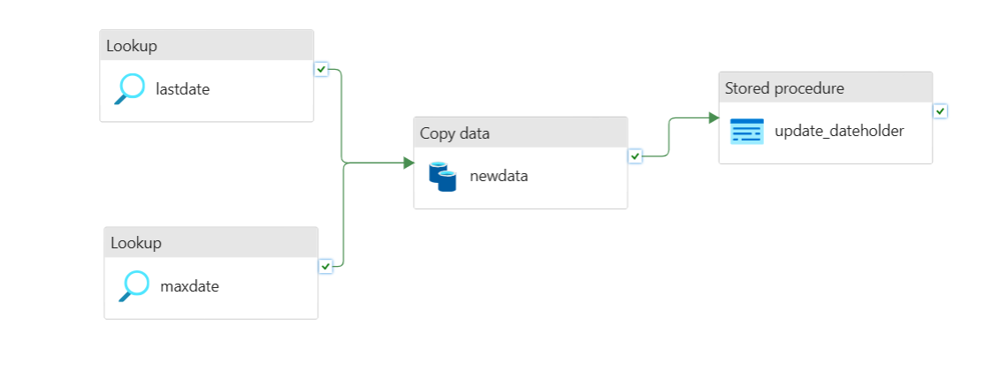
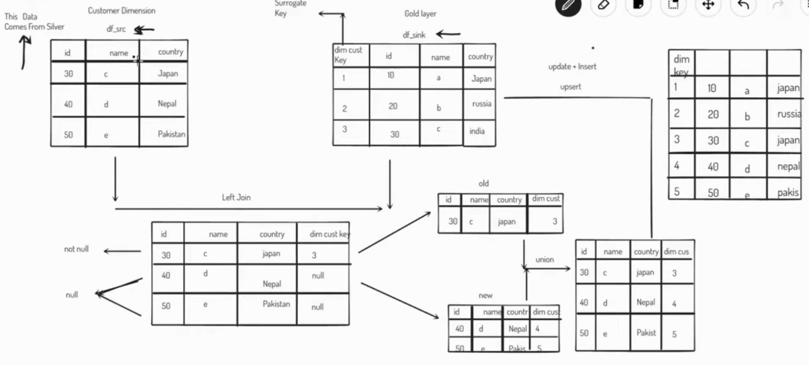
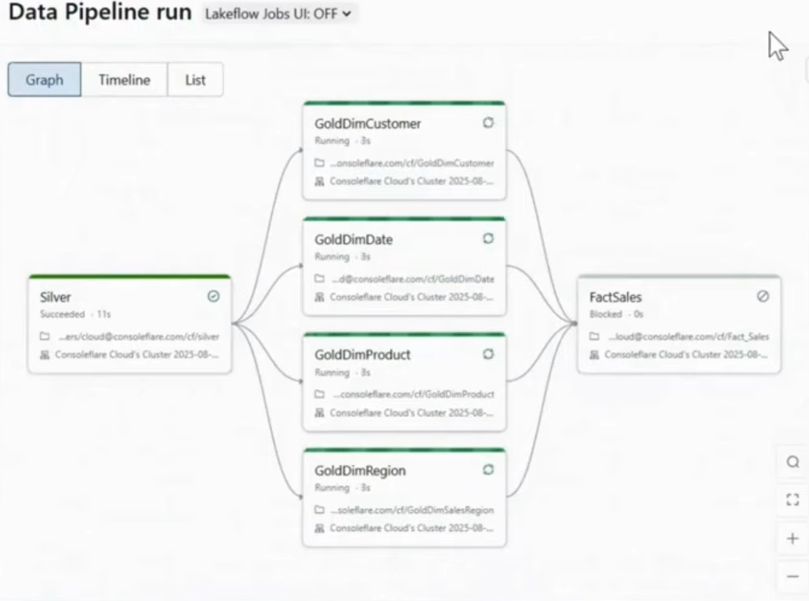

# Azure End-to-End Data Engineering Project

## Project Overview

This project demonstrates an end-to-end data engineering pipeline built on Azure and Databricks using the Medallion Architecture (Bronze → Silver → Gold).

The pipeline ingests raw sales data from GitHub, processes it using Azure Data Factory and Databricks, and builds dimensional models and fact tables in the Gold layer using Delta Lake.

The goal of this project is to simulate a real-world data engineering workflow including ingestion, transformation, incremental loading, and dimensional modeling.

---

## Architecture

The project follows the Medallion Architecture pattern:

- Bronze layer – raw data ingestion  
- Silver layer – cleaned and standardized data  
- Gold layer – dimensional model and fact tables  

---

## Tech Stack

- Azure Data Factory (ADF)  
- Azure Data Lake Storage Gen2 (ADLS)  
- Azure Databricks (PySpark)  
- Delta Lake  
- Azure SQL Database  
- GitHub  

---

## Data Pipeline Flow

### Step 1: Data Ingestion (ADF)

- Data is fetched from GitHub using HTTP linked service  
- Incremental load is handled using lookup activities (lastdate and maxdate)  
- Data is copied into the Bronze container  
- Stored procedure updates watermark table  

**Output (Image 1):**

---

### Step 2: Silver Layer Processing (Databricks)

- Bronze data is cleaned and standardized  
- Column formatting applied (initcap, type casting, etc.)  
- Data is written into Silver layer as Parquet  

**Output (Image 2):**

---

### Step 3: Gold Layer – Dimensional Modeling

Created the following dimension tables using Delta Lake:

- dim_customer  
- dim_product  
- dim_date  
- dim_region  

Implemented incremental upsert using Delta MERGE.

Fact table:

- fact_sales  

**Output (Image 3):**

---

## Key Features

- End-to-end Azure data pipeline  
- Incremental data loading using watermark logic  
- Medallion architecture implementation  
- Delta Lake merge (upsert) logic  
- Dimensional data model (star schema)  
- Production-style pipeline orchestration  

---

## Repository Structure

## Repository Structure

project-root/

- notebooks/ # Databricks notebooks
- adf/ # ADF ARM template / pipeline JSON
- sql/ # SQL scripts (if any)
- images/ # Architecture and pipeline screenshots
 README.md

## How to Run

1. Deploy Azure resources (ADLS, ADF, Databricks, SQL DB)  
2. Import ADF pipelines from ARM template  
3. Upload Databricks notebooks  
4. Configure storage credentials  
5. Run ADF pipeline  
6. Execute Databricks notebooks in order:
   - Silver
   - Dimensions
   - Fact

---

## Future Improvements

- Add CI/CD using Azure DevOps  
- Implement SCD Type 2  
- Add data quality checks  
- Add Unity Catalog integration  

